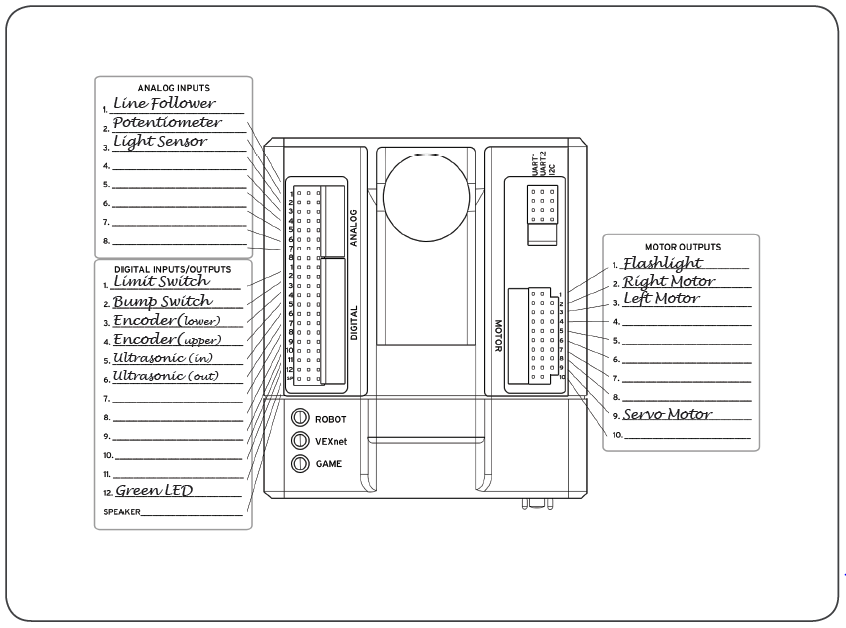

# PLTW Programming

## Table of Contents

- [PLTW Programming](#pltw-programming)
  - [Table of Contents](#table-of-contents)
  - [Motors and Sensor Setup](#motors-and-sensor-setup)
  - [Basic Programming](#basic-programming)
    - [Problem 1](#problem-1)
    - [Problem 2](#problem-2)
    - [Problem 3](#problem-3)
    - [Problem 4](#problem-4)
  - [While Loops and Timers](#while-loops-and-timers)
    - [Problem 5](#problem-5)
    - [Problem 6](#problem-6)
    - [Problem 7](#problem-7)
    - [Problem 8](#problem-8)
    - [Problem 9](#problem-9)
  - [If-Else Statements](#if-else-statements)
    - [Problem 10](#problem-10)
    - [Problem 11](#problem-11)
    - [Problem 12](#problem-12)
    - [Problem 13](#problem-13)
    - [Problem 14](#problem-14)
  - [Variables and Functions](#variables-and-functions)
    - [Problem 15](#problem-15)
    - [Problem 16](#problem-16)
    - [Problem 17](#problem-17)
  - [Putting it all Together](#putting-it-all-together)
    - [Problem 18](#problem-18)

## Motors and Sensor Setup
  
- Make sure the cables are plugged in according to the diagram below

    
Wiring diagram

    </img>

- In robotc, at the top click on `Robot` > `Motors and Sensors Setup`
- Go through the `Motors`, `Analog`, and `Digital` tabs and name and assign ports appropriately. Select `Ok` to close window
- Before writing any code, click `Save As` and name the file '\<last name> template'
- Save on your desktop and upload to google drive

## Basic Programming

### Problem 1

- The left motor starts at half speed CW for 1 second then turns off
- The right motor starts at half speed CW for 1 second then turns off
- The LED turns on for 2 seconds then turns off

___

### Problem 2

- The left motor starts at half speed CW until __the bump switch is pressed__ then turns off
- The right motor starts at half speed CW until __the limit switch is pressed__ then turns off
- The LED turns on until the __bump switch is pressed__ then turns off

___

### Problem 3

>__Notice__: Make sure the potentiometer is at zero before running this program

- The left motor starts at half speed CW until __the potentiometer is turned to 1500__ then turns off
- The right motor starts at half speed CW until __the light sensor is covered__ then turns off
- The LED turns on until __something comes within 6 inches of the sonar__ then turns off

___

### Problem 4

- The __right__ motor starts at half speed CW until __the bump switch is pressed__ then turns off
- Wait 1 Second
- The servo motor turns 60 degrees to the right _(set it to 127)_
- Wait until __the limit switch is pressed__
- Move the servo back to home position _(set it to 0)_
- Wait 1 second
- The __left__ motor starts at half speed CW until __the quad encoder turns 1 full rotation__ then turns off

[Top](#pltw-programming)

## While Loops and Timers

### Problem 5

- Forever:
  - The left motor starts at half speed CW for 1 second then turns off
  - The right motor starts at half speed CW for 1 second then turns off
  - The LED turns on for 2 seconds then turns off

___

### Problem 6

Copy program 5, but run for __10 seconds__ rather than forever

___

### Problem 7

- Forever:
  - Wait until the __light sensor__ is __blocked__ then turn __on__ the flashlight
  - Wait until the __light sensor__ is __not blocked__ then turn __off__ the flashlight

___

### Problem 8

Same as problem 7, but flashlight is only affected while the limit switch is __not__ pressed
>Make sure it still loops forever

___

### Problem 9

- Wait until the __bump switch__ is pressed
- LED turns on
- Wait 1 second
- For 15 seconds:
  - The __left motor__ starts at half speed CW until __the bump switch is pressed__ then turns off
  - The __right motor__ starts at half speed CW until __the limit switch is pressed__ then turns off
- The LED turns __off__ for 1 second
- The LED turns back __on__ for 1 second and then turns off

[Top](#pltw-programming)

## If-Else Statements

### Problem 10

- If the __line follower__ is __covered__, the LED turns __on__
- If the __line follower__ is __not covered,__ the LED turns __off__

### Problem 11

- If the bump switch is pressed, the right motor turns CW at half speed
- If the limit switch is pressed, the left motor turns CW at half speed

>If the switches are not pressed, be sure to stop the motors

### Problem 12

- Forever:
  - If the light sensor is covered, the flashlight turns on
  - If the light sensor is not covered, the flashlight turns off

>Looks similar to 7, but this one uses if statements

### Problem 13

- Forever:
  - If the limit switch is pressed, the servo motor turns either left or right _(127 or -127)_ depending on if the light sensor is covered
  - If the limit switch is not pressed, the servo motor moves to the home position

### Problem 14

- If the bump switch is pressed, the left motor turns CW at half speed
- If the limit switch is pressed, the right motor turns CW at half speed
- If the line follower is covered, the flashlight turns on

>Be sure that if each respective sensor is not covered/pressed, the motor or flashlight associated with it turns off

[Top](#pltw-programming)

## Variables and Functions

### Problem 15

Same as problem 1, but do it 5 times. Use `loopcount` as a variable name

### Problem 16

Same as problem 1, but use a function named `motorloop` and loop forever

### Problem 17

Combine problems 15 and 16: use a function named `motorloop` and `loopcount` as a variable name, and only loop 5 times

## Putting it all Together

### Problem 18

- Wait until the limit switch is pressed
- LED turns on
- Loop 5 times:
  - If light sensor is covered:
    - Left motor turns CW at half speed for 1 second then stops
    - Servo motor turns to 60 degrees to the right, stays for 2 seconds, then moves back to home position
  - If light sensor is not covered:
    - Right motor turns CW at half speed for 2 seconds then stops
    - Servo motor turns to 60 degrees to the left, stays for 2 seconds, then moves back to home position

[Top](#pltw-programming)
